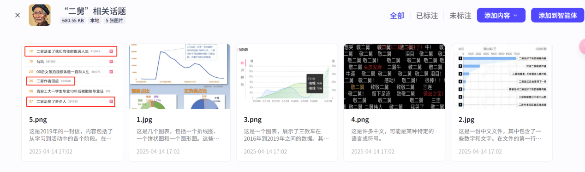

# 具体内容展开（大模型提示词和前端代码）

## 使用的智能体工具 -- coze

## 创建的智能体提示，并增添相关插件：


## 创建相关舆情分析照片数据集



## 步骤的提示词

[回村三天，二舅治好了我的精神内耗](https://www.bilibili.com/video/BV1MN4y177PB?vd_source=f7827f79bfc1512ea3519b49d4cfaeeb)请你根据以下舆情报告主题：**回村三天二舅治好了我的精神内耗**，搜集B站上面及全网的素材，进行舆情分析研判报告的撰写，过程中需确保信息的真实准确性，按照既定主题进行报告搜集工作。不限于图文等，可以展示视频发布后引起的反响，增添点优秀评论来支撑论点，对于观点分析可以多生成一点分析内容。


读取B站视频链接[回村三天，二舅治好了我的精神内耗](https://www.bilibili.com/video/BV1MN4y177PB?vd_source=f7827f79bfc1512ea3519b49d4cfaeeb)，[《回村三天 二舅治好了我的精神内耗》刷屏](https://www.bilibili.com/video/BV1rr4y1L7bz?vd_source=f7827f79bfc1512ea3519b49d4cfaeeb)，[二舅治愈了我的“精神内耗”，那谁来治愈二舅？](https://www.bilibili.com/video/BV1e94y1D7jN?vd_source=f7827f79bfc1512ea3519b49d4cfaeeb)，[“二舅”为何能治好我们的精神内耗？](https://www.bilibili.com/video/BV1Ut4y1G7Nk?vd_source=f7827f79bfc1512ea3519b49d4cfaeeb)，[一瘸一拐的二舅，治不了你的精神内耗](https://www.bilibili.com/video/BV1Vt4y1L7UE?vd_source=f7827f79bfc1512ea3519b49d4cfaeeb)，生成一份关于这个的数据分析报告。


## 进一步深入分析舆情发展过程

请你现在根据插入的（"二舅"相关话题）的数据集，进行进一步的深入分析舆情发展过程，融合上述生成的文章再叙述一遍。


## 视频成功引发广泛关注和讨论的原因分析

请你接着分析一下这个视频能够成功引发广泛关注和讨论的原因有哪些？


## “二舅”形象对当代年轻人的精神引领作用

请你继续分析“二舅”形象对当代年轻人的精神引领作用，并结合具体事例，说明“二舅”形象对当代年轻人的精神引领作用。


## 如何让“二舅”这样的正能量形象更好地影响年轻人

如何让“二舅”这样的正能量形象更好地影响年轻人，并利用社交媒体平台传播“二舅”这样的正能量形象？


## 相关话题的文献探讨总结

现在增加相关话题的文献探讨，请你进行总结并结合文章内容再重新增添叙述内容。


## 完善报告格式内容

最后请你按照以下要求完善报告格式内容：

- **报告摘要**：200~400字，需简要概括报告的核心内容，包括主题和主要观点。
- **报告结构**：结构清晰，章节逻辑连贯。内容划分明确，无混乱。
- **报告内容**：观点表述客观、明确，语言简洁，用词精准，主题突出，观点鲜明。表达形式多样，可辅以适量图表。


## 使用cursor实现可视化前端代码

### （1）首先爬取b站视频【回村三天，二舅治好了我的精神内耗】30条热门评论数

```python
import requests
import time

def bv2aid(bvid):
    url = f'https://api.bilibili.com/x/web-interface/view?bvid={bvid}'
    headers = {
        'User-Agent': 'Mozilla/5.0 (Windows NT 10.0; Win64; x64) AppleWebKit/537.36 (KHTML, like Gecko) Chrome/91.0.4472.124 Safari/537.36',
        'Referer': 'https://www.bilibili.com'
    }
    resp = requests.get(url, headers=headers)
    data = resp.json()
    if data['code'] == 0:
        return data['data']['aid']
    else:
        raise Exception(f"获取AID失败: {data['message']}")

def get_comments(aid, page=1, sort=0):
    url = 'https://api.bilibili.com/x/v2/reply'
    params = {
        'jsonp': 'jsonp',
        'pn': page,
        'type': 1,
        'oid': aid,
        'sort': sort  # 0: 最新, 2: 热门
    }
    headers = {
        'User-Agent': 'Mozilla/5.0 (Windows NT 10.0; Win64; x64) AppleWebKit/537.36 (KHTML, like Gecko) Chrome/91.0.4472.124 Safari/537.36',
        'Referer': 'https://www.bilibili.com'
    }
    resp = requests.get(url, params=params, headers=headers)
    data = resp.json()
    comments = []
    if data['code'] == 0 and data['data']['replies']:
        for reply in data['data']['replies']:
            uname = reply['member']['uname']
            message = reply['content']['message']
            like = reply['like']
            comments.append(f"用户: {uname}\n评论: {message}\n点赞数: {like}\n{'-'*50}")
    return comments

def main():
    bvid = "BV1MN4y177PB"  # 回村三天二舅治好了我的精神内耗
    print("正在获取AID...")
    aid = bv2aid(bvid)
    print(f"AID: {aid}")
    print("开始获取最热评论...")
    total_comments = []
    page = 1
    while len(total_comments) < 30:
        comments = get_comments(aid, page, sort=2)  # sort=2为最热
        if not comments:
            break
        total_comments.extend(comments)
        if len(comments) < 30:
            break
        page += 1
        time.sleep(1)
    total_comments = total_comments[:30]
    with open("二舅.txt", "w", encoding="utf-8") as f:
        for comment in total_comments:
            f.write(comment + "\n")
    print(f"已保存{len(total_comments)}条评论到二舅.txt")
```

### （2）利用【回村三天，二舅治好了我的精神内耗】的相关数据，做可视化前端。

```
<!DOCTYPE html>
<html lang="zh-CN">
<head>
    <meta charset="UTF-8">
    <meta name="viewport" content="width=device-width, initial-scale=1.0">
    <title>图片展示</title>
    <style>
        * {
            margin: 0;
            padding: 0;
            box-sizing: border-box;
        }
        body {
            font-family: 'Microsoft YaHei', sans-serif;
            background-color: #f5f5f5;
            padding: 20px;
        }
        .container {
            max-width: 1400px;
            margin: 0 auto;
        }
        .image-grid {
            display: grid;
            grid-template-columns: repeat(2, 1fr);
            gap: 20px;
            margin-bottom: 30px;
        }
        .image-section {
            background-color: white;
            border-radius: 10px;
            padding: 20px;
            box-shadow: 0 2px 10px rgba(0,0,0,0.1);
            height: 100%;
            display: flex;
            flex-direction: column;
        }
        .description {
            color: #333;
            line-height: 1.6;
            font-size: 16px;
            margin-bottom: 15px;
        }
        .description p {
            font-size: 30px;
            font-weight: 600;
            color: #2c3e50;
        }
        .image-container {
            width: 100%;
            flex-grow: 1;
        }
        .image-container img {
            width: 100%;
            height: 100%;
            object-fit: cover;
            border-radius: 8px;
            transition: transform 0.3s ease;
        }
        .image-container img:hover {
            transform: scale(1.02);
        }
        h1 {
            text-align: center;
            color: #333;
            margin-bottom: 30px;
            font-size: 2.5em;
            font-weight: 800;
            letter-spacing: 2px;
        }
        .full-width {
            grid-column: span 2;
        }
        @media (max-width: 768px) {
            .image-grid {
                grid-template-columns: 1fr;
            }
            .full-width {
                grid-column: span 1;
            }
            h1 {
                font-size: 2.5em;
            }
            .description p {
                font-size: 16px;
            }
        }
    </style>
</head>
<body>
    <div class="container">
        <h1>图片展示与说明</h1>
        <div class="image-grid">
            <div class="image-section full-width">
                <div class="description">
                    <p>视频内容的播放数据趋势图，能直观呈现其播放量随时间的变化</p>
                </div>
                <div class="image-container">
                    
                </div>
            </div>
            <div class="image-section">
                <div class="description">
                    <p>抖音平台上 "二舅" 相关话题热度数据</p>
                </div>
                <div class="image-container">
                    
                </div>
            </div>
            <div class="image-section">
                <div class="description">
                    <p>与 "二舅" 相关的网络热搜词条，反映了 "二舅" 相关内容的传播热度和公众讨论方向</p>
                </div>
                <div class="image-container">
                    
                </div>
            </div>
            <div class="image-section full-width">
                <div class="description">
                    <p>"二舅" 相关内容下的弹幕</p>
                </div>
                <div class="image-container">
                    
                </div>
            </div>
            <div class="image-section full-width">
                <div class="description">
                    <p>"二舅" 视频传播的舆情数据，能从多维度解析热度</p>
                </div>
                <div class="image-container">
                    
                </div>
            </div>
        </div>
    </div>
</body>
</html>
```


